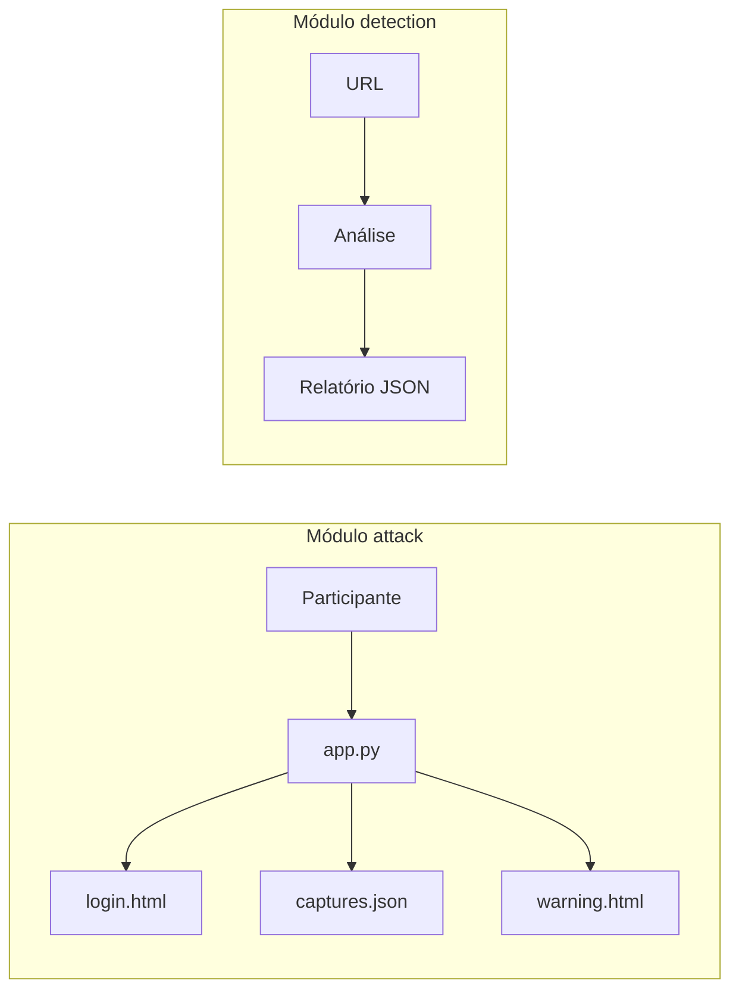

# Arquitectura — Simulação e Deteção de Phishing

Diogo Sá (31378) · Diogo Monteiro (32428)

---

## Visão geral



| Módulo      | Stack principal                          |
|-------------|------------------------------------------|
| **attack**  | Python, Flask, HTML/CSS, JSON            |
| **detection** | Python, requests, dnspython, pyOpenSSL |

---

## Módulo attack — fluxo

1. **GET /** — Flask serve `login.html` (clone visual Microsoft 365).
2. **POST /capture** — Recebe `username` e `password`; apenas o email/identificador é persistido.
3. **logger.py** — Acrescenta entrada a `data/logs/captures.json`.
4. **Redirect /warning** — Serve `warning.html` com explicação e boas práticas.

### Dados registados

```json
{
  "timestamp": "2026-06-04T15:30:00.000000+00:00",
  "email": "utilizador@empresa.pt",
  "ip": "192.168.1.10",
  "user_agent": "Mozilla/5.0 ...",
  "victim_id": "uuid-v4"
}
```

| Campo        | Descrição                                      |
|--------------|------------------------------------------------|
| `timestamp`  | Data/hora UTC (ISO 8601)                         |
| `email`      | Identificador submetido no formulário            |
| `ip`         | Endereço do cliente (ou primeiro IP do proxy)    |
| `user_agent` | String do browser                                |
| `victim_id`  | UUID único por submissão                         |

A password não é escrita em disco.

### Rotas

| Método | Rota       | Resposta                    |
|--------|------------|-----------------------------|
| GET    | `/`        | `login.html`                |
| POST   | `/capture` | Log + redirect `/warning`   |
| GET    | `/warning` | `warning.html`              |

Servidor: `0.0.0.0:5000`, `debug=False`, `TEMPLATES_AUTO_RELOAD=True`.

---

## Módulo detection — planeado

Análise passiva de alvos suspeitos:

- WHOIS e registos DNS
- Validade e emissor do certificado TLS
- Cabeçalhos HTTP de segurança
- Estrutura HTML (formulários, links externos)

Saída prevista em `data/reports/`.

---

## Considerações de segurança

- Execução apenas em ambiente isolado.
- Sem persistência de passwords.
- Página `warning.html` desfaz o engano após a simulação.
- Sem hardening de produção (HTTPS, rate limiting) — adequado só a laboratório.
